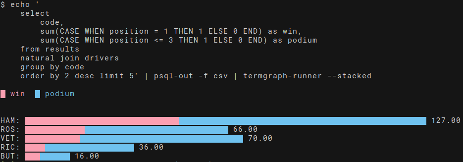

# Hacky tools for PostgreSQL

Hacky tools for PostgreSQL that makes interacting / extracting / analysis of data in PostgreSQL easier.



NOTE: Examples are from a PostgreSQL version of [ergast](https://ergast.com/mrd/).

## psql-out

Sometimes I find I have requests like the following:

 > Run this query and give me the results [in an Excel file so I can look at them in Excel].

Also sometimes I want to:

 > Run a complicated query and get the results as [ndjson](http://ndjson.org/) so I can process them in JavaScript.

But sometimes I'm:

 > Looking at data trying to figure out if a hypothesis makes sense and want to throw things into graphs very, very quickly.

It's not cool, it's not pretty, but this is what `psql-out` is for!

If you've got your environmental variables set up (see `pgpass-env` lower down) you can do something like the following:

```shell
echo 'select name, position from competitors' | psql-out
```

And get a well formed CSV file out into STDOUT.

To write it to a file you just need to add `> your_file.csv` to the end to pipe STDOUT to the desired file:

```shell
echo 'select name, position from competitors' | psql-out > your_file.csv
```

 If you want it as an ndjson file you can run

```shell
echo 'select name, position from competitors' | psql-out -f ndjson
```

To get an ndjson file out. You can also get a TSV (Tab seperated CSV) out by passing `-t tsv`.

## termgraph-runner

When you've got your nice CSV using the tools from above and you want to see if the data looks correct quickly one of the best ways I know to do this is to draw a quick graph. You could fire up Excel or [LibreOffice](https://www.libreoffice.org/) and pointy-clicky to get your graph. This is a __really__ bad solution if you're still finding out whether your data is correct because that feedback loop of command-line -> csv -> spreadsheet > graph is pretty long. What if you could quickly draw graphs right in your terminal... You can using termgraph-runner (which is backed by the awesome [termgraph](https://github.com/mkaz/termgraph).

```shell
echo '
    select
        code,
        sum(CASE WHEN position = 1 THEN 1 ELSE 0 END) as win,
        sum(CASE WHEN position <= 3 THEN 1 ELSE 0 END) as podium
    from results
    natural join drivers
    group by code
    order by 2 desc limit 5' | psql-out -f csv | termgraph-runner --stacked
```

## pgpass-env

I found that I have files that look like the following in the root of most of my source code repositories (and in my `.gitignore` of course):

```shell
export PGHOST="127.0.0.1"
export PGDATABASE="my_product"
export PGUSER="my_product"
export PGPASSWORD="a_good_password"
export PGPORT="5432"
export LISTEN_PORT="4040"
```

However for my database administration GUI I also have a `~/.pgpass` file in my home directory with the following:

    127.0.0.1:5432:my_product:my_product:a_good_password

This is a duplication of data and is kinda ridiculous.

Enter `pgpass-env` which is a simple bash script that converts the former into the latter

The idea is to store a name above the lines in the ~/.pgpass like the following

    # local_my_product
    127.0.0.1:5432:my_product:my_product:a_good_password
    # local_another_product
    127.0.0.1:5432:another_product:another_product:a_good_password

Running just `pgpass-env` it gives you a list of possible options:

```shell
$ pgpass-env
Pass one of the following
    * local_my_product
    * local_another_product
```

But if you would pass the name of a connection it would output:

```shell
$ . pgpass-env local_my_product
> postgres://my_product@127.0.0.1:5432/my_product
```

While at the same time performing the required `EXPORT PGUSER=my_product` etc. Using the preceding `.` means those environmental variables will be brought into the current environment, which is probably what you want.

It also adds adds `$DATABASE_URL` which I use in [vim-dadbod](https://github.com/tpope/vim-dadbod) but I also understand is used by Heroku.

NOTE: Look at the BASH source code, `pgpass-env` is quick, simple code to get the job done, __not__ perfect code. You can see that the .pgpass fields are separated by `:` but I have put no thought in how to escape a `:` should one be included in a password. If your password includes a `:` it'll probably break.

## Installation

Installation is simple with some BASH tomfoolery:

```shell
find . -maxdepth 1 -type f -executable | parallel ln -s "$PWD/{/}" ~/.local/bin
```

## Other interesting tools I've found to do portions of this...

I've not found anything that I can use to draw pie charts simply in the terminal - ideas welcome.

### Software

 * [graph-cli](https://github.com/mcastorina/graph-cli) Can accept input from STDIN and will pop up your graph in a window.
 * [Veusz](https://veusz.github.io/) Is a desktop app which looks like a mix of Tableau and a DTP application. It's file format is plain text and it even has a Python API. It should be possible to wrap this and spit out a great image file.
 * [feedgnuplot](https://github.com/dkogan/feedgnuplot) looks like the thing I'd use if I wanted to draw a line graph. Because it's based on gnuplot it can draw your line graph right in the terminal or can popup a window.

### Libraries

 * [ggplot](https://github.com/tidyverse/ggplot2) is an R library for drawing graphs, could probably whip something up again to output an image file.
 * [vega](https://vega.github.io/) and vega-lite are by far the best JavaScript graphing libraries I've ever come across. You can specify a graph using just json and they have a [CLI interface](https://vega.github.io/vega/usage/#cli) that can spit out png's etc.
